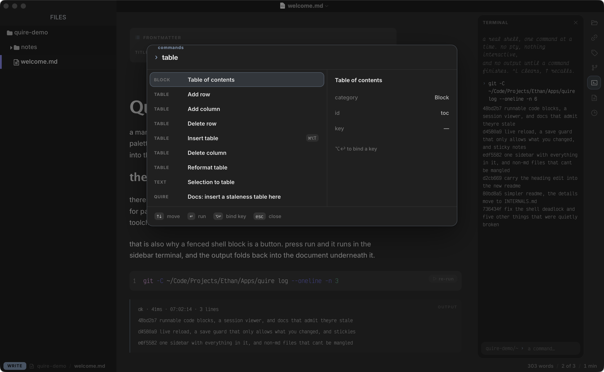

# quire

a markdown editor, built on the bones of an old one.



---

## why this exists

i took typora 0.11.18 apart to learn how
([typora-teardown](https://github.com/Cadaquesenc/typora-teardown)). then i
started writing my own editor from scratch, got about 800 lines in, and threw it
away.

the teardown had already answered the question.

**five of the six features i wanted were already in the app, finished, switched
off.** file tree, pandoc export, math, diagrams, paste an image and it saves it.
all shipped in 2021, all sitting behind a setting that defaults to zero. nobody
ever turned them on.

so quire isn't a rewrite. it's nine settings flipped, a new shell around the app,
and about 2,000 lines of the things that really weren't there.

## the one door

the app is a web page in a costume. web pages can't touch your files or run
programs, and this one is locked down tight.

but it has a leftover door. one function that runs a program, put there so the
app could export files with pandoc.

i assumed it took a list of arguments. it doesn't. **it takes a plain string and
hands it to a shell.**

so it isn't a pandoc button. it's a shell.

backlinks, tags, git, the file list, the terminal. all of it is `grep`, `find`
and `git`, going out through a door built for one export format.

## what it adds as of now

- **command palette** (`⌘⌥P`). 91 commands, searchable.
- **shortcuts you can rebind.** click a row, press a key. typora on mac can't do
  this at all.
- **backlinks and tags.** write `[[a note]]` or `#tag` and it finds every mention
  in the folder.
- **git.** branch and unsaved count in the status bar. commit and diff from the
  palette.
- **daily notes.** one per day, quick capture, templates.
- **a file panel.** everything in the folder, filterable.
- **a terminal.** a real shell, through that same door.
- **20 text transforms.** sort, dedupe, turn a selection into a table.
- **a status bar.** file, git, words, tasks, reading time.

plus the five that were already in there, now switched on.

## the look

dark, frosted, quiet. colours from ghostty, text hierarchy from discord,
restraint from apple, palette and key hints shaped like lazyvim's.

the window blur isn't something javascript can ask for, so a small rust library
turns it on.

## building it

you supply the runtime. `vendor/base.app` isn't in this repo and never will be.
shipping it would mean redistributing someone else's app.

```
cp -R "/Applications/Typora.app" vendor/base.app
./build.sh --run
```

that builds `Quire.app` into `~/Applications`. an edited app won't launch on
apple silicon until it's signed again, which `resign.sh` does.

everything in `src/`, `native/` and `brand/` is mine. the app underneath isn't.
that's why you build it yourself instead of downloading it.

fonts are Inter and Victor Mono, both openly licensed. see `src/FONTS.md`.

## what it can't do

no filesystem except through that one door. no new menu items, since the app can
only switch on menus it already has. and the markdown engine can't be replaced,
which is why this is a fork and not a rewrite.

## more detail

[`INTERNALS.md`](INTERNALS.md).
